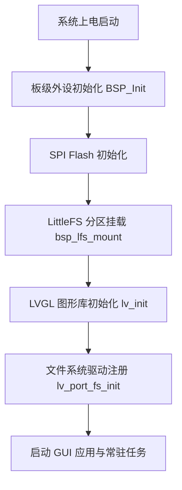

# LVGL v9.3.0 移植 LittleFS 文件系统教程与报告

本教程详细记录了如何在 **STM32F407VETx** 平台上，将底层的 **LittleFS** 文件系统对接并注册至 **LVGL v9.3.0** 图形库，建立以 **F** 为盘符的虚拟磁盘驱动器，从而为 GUI 提供图片、字体及二进制资产的动态加载能力。

---

## 一、 移植背景与依赖分析

### 1.1 依赖关系
在系统软件架构中，文件系统移植层（**lv_port_fs**）作为桥梁，将 **LVGL** 通用的虚拟文件系统（**VFS**）操作抽象接口，向下转化为具体的 **LittleFS** 文件系统操作。
- 硬件层：**W25Q128** (128M-bit QSPI/SPI Flash)。
- 物理驱动层：**dev_w25q.c/h** 提供底层的扇区擦写与读取接口。
- 文件系统层：**bsp_lfs.c/h** 提供 LittleFS 的分区挂载、API 封装及基于信号量的并发互斥锁。
- 移植适配层：**lv_port_fs.c/h** 向 **LVGL** 注册磁盘驱动，对接回调函数。

### 1.2 移植文件列表
在 **MDK-ARM** 工程的 **Middleware/LVGL/Porting** 分组中新增：
- **Middleware/lvgl/examples/porting/lv_port_fs.h**：移植层公共初始化接口声明。
- **Middleware/lvgl/examples/porting/lv_port_fs.c**：接口注册与回调的具体逻辑实现。

---

## 二、 详细移植步骤

### 步骤 1：准备标准模板
将 LVGL 官方模板 **lv_port_fs_template.c/h** 复制并重命名为 **lv_port_fs.c/h**，清除模板中对旧版本（如 v8）API 的兼容宏，保持与 **LVGL v9.3.0** 一致。

### 步骤 2：注册文件系统驱动
在 **lv_port_fs_init** 中配置 **lv_fs_drv_t** 结构体并向内核注册：

```c
void lv_port_fs_init(void)
{
    /* 静态分配驱动结构体以防生命周期结束被释放 */
    static lv_fs_drv_t fs_drv;
    lv_fs_drv_init(&fs_drv);

    /* 设定盘符为大写 'F'（映射至 Flash 分区） */
    fs_drv.letter = 'F';
    
    /* 绑定底层 API 回调函数 */
    fs_drv.ready_cb = fs_ready;
    fs_drv.open_cb = fs_open;
    fs_drv.close_cb = fs_close;
    fs_drv.read_cb = fs_read;
    fs_drv.write_cb = fs_write;
    fs_drv.seek_cb = fs_seek;
    fs_drv.tell_cb = fs_tell;

    /* 注册至 LVGL 文件系统管理器 */
    lv_fs_drv_register(&fs_drv);
}
```

### 步骤 3：实现核心文件操作回调
下面是关键回调函数与 LittleFS 底层 API 的对接逻辑：

#### 3.1 打开文件回调 (**fs_open**)
需要注意：
- **LVGL** 传入的 **path** 会剥离盘符前缀（例如传入 **F:/image.bin**，在回调中获取的 **path** 为 **/image.bin**）。
- **LVGL** 的打开模式 **lv_fs_mode_t** 需要转换为 LittleFS 的打开标志。
- 为了支持多文件并发打开，我们必须动态为每个打开的文件分配一个 **lfs_file_t** 对象，并将其作为句柄指针返回。

```c
static void * fs_open(lv_fs_drv_t * drv, const char * path, lv_fs_mode_t mode)
{
    (void) drv;
    
    /* 获取底层挂载成功的 LittleFS 句柄 */
    lfs_t *lfs = bsp_lfs_get_handle();
    if (lfs == NULL)
    {
        return NULL;
    }

    /* 动态分配 LittleFS 的文件操作控制块 */
    lfs_file_t *file = lv_malloc(sizeof(lfs_file_t));
    if (file == NULL)
    {
        return NULL;
    }

    /* 转换读写模式 */
    int flags = 0;
    if (mode == LV_FS_MODE_RD)
    {
        flags = LFS_O_RDONLY;
    }
    else if (mode == LV_FS_MODE_WR)
    {
        flags = LFS_O_WRONLY | LFS_O_CREAT | LFS_O_TRUNC;
    }
    else if (mode == (LV_FS_MODE_RD | LV_FS_MODE_WR))
    {
        flags = LFS_O_RDWR | LFS_O_CREAT;
    }

    /* 打开文件 */
    int err = lfs_file_open(lfs, file, path, flags);
    if (err < 0)
    {
        lv_free(file);
        return NULL;
    }

    return file; /* 返回指针供后续读写 API 使用 */
}
```

#### 3.2 关闭文件回调 (**fs_close**)
关闭文件时，除了调用 **lfs_file_close** 提交修改，还必须使用 **lv_free** 释放打开时动态申请的内存，防止内存泄漏。

```c
static lv_fs_res_t fs_close(lv_fs_drv_t * drv, void * file_p)
{
    (void) drv;
    if (file_p == NULL)
    {
        return LV_FS_RES_INV_PARAM;
    }

    lfs_t *lfs = bsp_lfs_get_handle();
    lfs_file_t *file = (lfs_file_t *)file_p;

    int err = lfs_file_close(lfs, file);
    lv_free(file); /* 释放内存 */

    return (err < 0) ? LV_FS_RES_FS_ERR : LV_FS_RES_OK;
}
```

#### 3.3 读取文件回调 (**fs_read**)
将 LittleFS 读取出的实际字节数更新写入 **br**。

```c
static lv_fs_res_t fs_read(lv_fs_drv_t * drv, void * file_p, void * buf, uint32_t btr, uint32_t * br)
{
    (void) drv;
    if (file_p == NULL || buf == NULL)
    {
        return LV_FS_RES_INV_PARAM;
    }

    lfs_t *lfs = bsp_lfs_get_handle();
    lfs_file_t *file = (lfs_file_t *)file_p;

    lfs_ssize_t read_bytes = lfs_file_read(lfs, file, buf, btr);
    if (read_bytes < 0)
    {
        if (br) *br = 0;
        return LV_FS_RES_FS_ERR;
    }

    if (br)
    {
        *br = (uint32_t)read_bytes;
    }

    return LV_FS_RES_OK;
}
```

#### 3.4 寻址与位置回调 (**fs_seek** / **fs_tell**)
- **fs_seek**：需要把 LVGL 定义的寻址起点（**LV_FS_SEEK_SET**、**LV_FS_SEEK_CUR**、**LV_FS_SEEK_END**）转接成 LittleFS 的寻址模式（**LFS_SEEK_SET**、**LFS_SEEK_CUR**、**LFS_SEEK_END**）。
- **fs_tell**：直接返回当前读写指针的相对偏移。

```c
static lv_fs_res_t fs_seek(lv_fs_drv_t * drv, void * file_p, uint32_t pos, lv_fs_whence_t whence)
{
    (void) drv;
    if (file_p == NULL)
    {
        return LV_FS_RES_INV_PARAM;
    }

    lfs_t *lfs = bsp_lfs_get_handle();
    lfs_file_t *file = (lfs_file_t *)file_p;

    int lfs_whence = LFS_SEEK_SET;
    if (whence == LV_FS_SEEK_CUR)
    {
        lfs_whence = LFS_SEEK_CUR;
    }
    else if (whence == LV_FS_SEEK_END)
    {
        lfs_whence = LFS_SEEK_END;
    }

    lfs_soff_t err = lfs_file_seek(lfs, file, (lfs_soff_t)pos, lfs_whence);
    return (err < 0) ? LV_FS_RES_FS_ERR : LV_FS_RES_OK;
}
```

---

## 三、 生命周期的生命线与挂载顺序

在嵌入式开发中，文件系统和 GUI 系统的初始化顺序至关重要。
必须遵循以下启动逻辑顺序：



如果在挂载 LittleFS 之前调用了 **lv_port_fs_init** 或在加载主题资产时底层分区尚未就绪，LVGL 会因为找不到对应的设备驱动直接返回硬件错误。

---

## 四、 功能测试与验证流程

为确保文件系统接口绝对可靠，采用**测试代码独立解耦**的方式，设计了专用的测试 Demo。

### 4.1 独立测试演示设计
在 **APP/demos/** 下创建了 **app_lvgl_fs_demo.c/h**，其测试机制如下：
1. **自动测试**：系统完成开机初始化后，自动通过 LVGL 接口以 **F:/test_lvgl_fs.txt** 为目标路径写入测试文本数据，并在关闭后重新以只读模式打开，校验读取的字符内容和长度是否与写入完全一致。
2. **终端交互测试**：基于 Letter Shell 终端软件导出交互函数。

### 4.2 串口终端指令验证
您可以在串口终端中输入以下指令，手动随时触发 LVGL 文件系统读写测试：
```shell
lvgl_fs_test
```

控制台预期输出信息：
```
I/APP_LVGL_FS     [10787] Starting LVGL File System test on 'F' drive...
I/APP_LVGL_FS     [10793] LVGL FS: Write success, bytes written = 55
I/APP_LVGL_FS     [10797] LVGL FS: Read data = [LVGL File System integrated successfully with LittleFS!], bytes read = 55
```

---

## 五、 开发注意事项与踩坑指南

1. **宏定义 LOG_TAG 重定义警报**：
   - 痛点：在 **app_lvgl_fs_demo.c** 中，若先包含本地头文件，再定义 **LOG_TAG**，由于部分头文件（如 **bsp_logger.h**）内部引用的 EasyLogger 工具链（**elog.h**）会在未检测到 **LOG_TAG** 时自动为其指派默认值，进而触发宏的重定义冲突。
   - 解决方案：必须保证在包含任何与日志相关的头文件之前，首先定义其局部的 **LOG_TAG**：
     ```c
     #define LOG_TAG "APP_LVGL_FS"
     #include "app_lvgl_fs_demo.h"
     #include "bsp_logger.h"
     ```

2. **动态控制块的释放防漏**：
   - 痛点：LVGL 每次调用 **lv_fs_open** 都会向堆空间申请控制块内存。如果在退出逻辑中，仅仅调用底层 LittleFS 库关闭了物理文件，而遗漏了销毁该动态内存指针，当 GUI 切换频繁加载图片时，会导致堆空间在短时间内被完全耗尽。
   - 解决方案：必须在 **fs_close** 接口的回调末尾加上 **lv_free(file_p)**。

3. **缓存性能优化**：
   - 目前在移植层将 **cache_size** 设置为 0。若后续发现读取大图卡顿，可在 **lv_port_fs_init** 中配置内核级缓冲（分配一部分 RAM 给 LVGL 做文件缓冲），以空间换时间。
